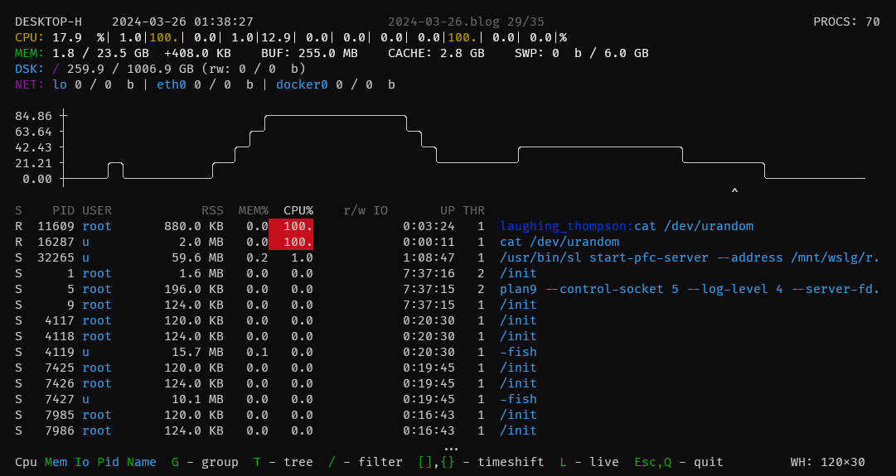

[](https://github.com/inv2004/ttop/actions/workflows/build.yaml)
[](https://github.com/inv2004/ttop/releases/latest)
[](https://aur.archlinux.org/packages/ttop)
[](https://github.com/inv2004/ttop/releases/latest)

# ```ttop```

System monitoring tool with historical data service, triggers and top-like TUI




- [x] Saving historical snapshots via systemd.timer or crontab
      
    * It is the main diff from `htop`, `top`, `btop` and etc

- [x] Scroll via historical data
- [x] External triggers (for notifications or other needs)
- [x] Ascii graph of historical stats (via https://github.com/Yardanico/asciigraph)
      
   * by default you see full day on the chart, see the moment of the spike and move into it for a detailed analysis

- [x] TUI with critical values highlights
- [x] Group by program
- [x] Search filters: `@u` - user u, `#d` - docker d
- [x] Temperature via `sysfs`
- [x] User-space only, doesn't require root permissions
- [x] Docker-related info
- [x] Threads tree
- [x] Static build

## Install

### Arch/AUR
```bash
yay -S ttop             # enables systemd.timers automatically
```

### Static binary (x86-64)

```bash
curl -LO https://github.com/inv2004/ttop/releases/latest/download/ttop \
&& chmod +x ttop
```

```bash
mv ttop ~/.local/bin/   # add into PATH if necessary
ttop --on               # Optional: enable data collector in user's systemd.timers or crontab
```

### Uninstall
```bash
ttop --off
rm ~/.local/bin/ttop
```

### Build from source
```bash
curl https://nim-lang.org/choosenim/init.sh -sSf | sh    # Nim setup from nim-lang.org
```
```bash
git clone https://github.com/inv2004/ttop
cd ttop
nimble -d:release build
```

### Triggers / Notifications
* stmp support was removed in prev version by the reason that static binary with ssl is more that 3Mb

From v0.8.1 you can trigger external tool, for example curl, to send notifications


### Config example
`~/.config/ttop/ttop.toml` or `/etc/ttop.toml`

#### My own server's config

```toml
[[trigger]]
cmd = "$HOME/.local/bin/tel.sh"
```

#### Config with all parameters described (if you need it)

```toml
# light = false            # set true for light term (default = false)

# refresh_timeout = 1000   # TUI refresh timeout

# docker = "/var/run/docker.sock"   # docker's socket path

# [data]
# path = "/var/log/ttop" # custom storage path (default = if exists /var/log/ttop, else ~/.cache/ttop )

# Trigger is any external script or command which receives text from ttop into stdin + some envs
[[trigger]]              # telegram example
on_alert = true          # execute trigger on alert (true if no other on_* provided)
on_info = true           # execute trigger without alert (default = false)
debug = false            # output stdout/err from cmd (default = false)
cmd = '''
read -d '' TEXT
curl -X POST \
  -H 'Content-Type: application/json' \
  -d "{\"chat_id\": $CHAT_ID, \"text\": \"$TEXT\", \"disable_notification\": $TTOP_INFO}" \
  https://api.telegram.org/bot$TELEGRAM_BOT_TOKEN/sendMessage
'''

# cmd receives text from stdin. The following env vars are set:
#   TTOP_ALERT (true|false) - if alert
#   TTOP_INFO  (true|false) - opposite to alert
#   TTOP_TYPE  (alert|info) - trigger type
#   TTOP_HOST               - host name
# you can find your CHAT_ID by send smth to your bot and run:
#    curl https://api.telegram.org/bot$TELEGRAM_BOT_TOKEN/getUpdates

[[trigger]]               # smtp example
cmd = '''
read -d '' TEXT
TEXT="Subject: ttop $TTOP_TYPE from $TTOP_HOST

$TEXT"
echo "$TEXT" | curl --ssl-reqd \
  --url 'smtps://smtp.gmail.com:465' \
  --user 'login:password' \
  --mail-from 'from@gmail.com' \
  --mail-rcpt 'to@gmail.com' \
  --upload-file -
'''
```
